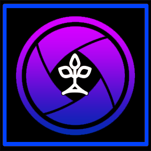

# NecroLens

[FFXIVQuickLauncher](https://github.com/goaaats/FFXIVQuickLauncher) plugin.

This Plugin allows you to explore a DeepDungeon with a tool like the HoloLens or GoogleGlass on.
You will be able to see trough walls, see where monster are looking ore be aware of you and many more.

This is an ESP hack (extrasensory perception), so don't use it if you not feel well.

## Installation
For installation instructions, please see my [custom plugin repo](https://github.com/Jukkales/DalamudPlugins).

